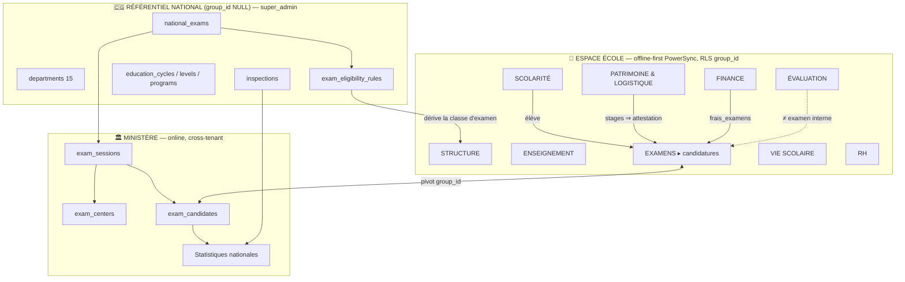
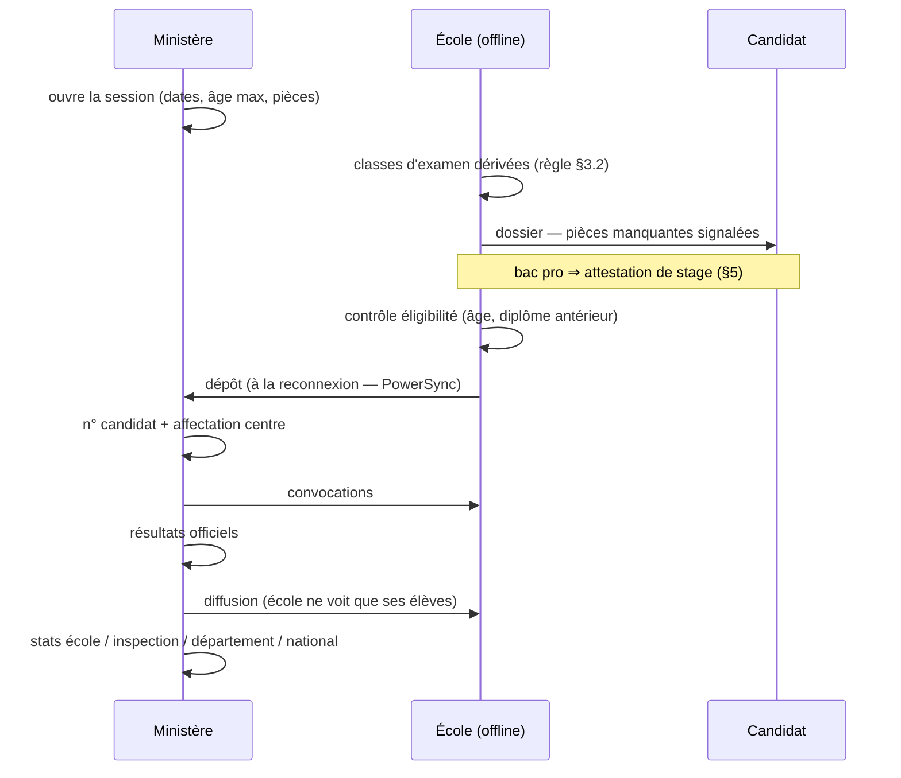

# Analyse fonctionnelle — catégories, modules & examens nationaux

**Date** : 2026-07-17 · **Statut** : analyse + proposition (aucun code écrit)
**Méthode** : tout ce qui suit est vérifié sur la **base live** (`psql`, 85 tables) et sur des **sources publiques congolaises**. Ni `schema.sql`, ni `docs/CONTEXTE.md`, ni ma mémoire projet n'ont été considérés comme fiables — deux d'entre eux se sont d'ailleurs révélés faux (voir §0).

---

## 0. Ce que la vérification a démenti

Avant d'analyser, il faut nettoyer les fausses évidences. Trois sources internes étaient périmées :

| Source | Affirmait | Réalité live |
|---|---|---|
| `CLAUDE.md` | ~66 tables | **85 tables** |
| Mémoire `modules-natifs-communication` | 36 modules / 7 catégories | **28 modules / 6 catégories** |
| Mémoire `catalogue-modules-v2` | 28 modules / 6 catégories | ✅ exact |

**Catalogue réel** (`modules` × `module_categories`) :

| Catégorie | Modules |
|---|---|
| SCOLARITÉ (5) | inscriptions, eleves, transferts, documents, annuaire |
| ENSEIGNEMENT (6) | niveaux, classes, matieres, programmes, emploi-du-temps, cahier-textes |
| ÉVALUATION (3) | notes, bulletins, conseils |
| VIE SCOLAIRE (6) | presences-eleves, discipline, infirmerie, cantine, bibliotheque, orientation |
| FINANCE (4) | frais-scolarite, paiements-eleves, depenses, budget |
| RESSOURCES HUMAINES (4) | personnel, presences-personnel, conges, paie |

Gating par plan : `gratuit` 7 · `premium` 16 · `pro` 26 · `institutionnel` 28.

**Un point vérifié et correct** : le tableau de bord affiche « 15 départements au Congo ». C'est **exact** — le pays est passé de 12 à 15 départements par la réforme de 2024 (loi n° 27-2024 créant le Congo-Oubangui). Bon réflexe déjà en place.

---

## 1. Corrections factuelles à votre brief

Vous avez demandé la vérité, y compris contre votre propre énoncé.

| Votre brief | Vérifié | Correction |
|---|---|---|
| « CEP (Certificat d'Études Primaires) » | ❌ | **CEPE** — Certificat d'Études Primaires **Élémentaires**. Session 2025 : 137 247 candidats, 606 centres, 87,81 % d'admis. |
| CM2 → CEPE | ✅ | exact |
| 3ᵉ Enseignement Général → BEPC | ✅ | exact |
| 3ᵉ Enseignement Technique → BET | ✅ | exact **mais inexprimable** dans le modèle actuel (§2.2) |
| Terminale → Baccalauréat | ⚠️ | il existe **trois** baccalauréats : **général**, **technique**, **professionnel** |
| Dernière année pro → « CAP ou autre diplôme » | ✅ | CAP confirmé, et la famille est plus large : **BET, BEP, BTF, CAP, CQP** |
| — | ➕ | **Concours d'entrée en 2ⁿᵈᵉ** : examen national absent de votre liste |

**Référentiel national vérifié :**

- **MEPSA** : CEPE (CM2) · BEPC (3ᵉ) · Concours d'entrée en 2ⁿᵈᵉ · Baccalauréat général (Tle)
- **METP** : BET · BEP · BTF (Brevet de Technicien Forestier) · CAP · CQP · Baccalauréat technique · Baccalauréat professionnel

**Les conditions d'inscription sont réglementaires et datées**, donc à paramétrer, pas à coder en dur :
- limites d'âge : **24 ans** (baccalauréats), **20 ans** (BET/CAP), **21 ans** (autres brevets) ;
- fenêtre d'inscription : 8 déc. 2025 → 14 févr. 2026 (session 2025-2026) ;
- dossier : acte de naissance ×2, 4 photos, chemise, enveloppe A4, frais ;
- pour les bacs : **copies légalisées du diplôme antérieur** (BEPC, BEMG, BET, BEP) **+ attestation de stage**.

Cette dernière ligne a une conséquence architecturale directe (§4.1) : **sans module Stages, un dossier de bac professionnel est incomplet.**

---

## 2. Les verrous structurels — à lever AVANT d'ajouter des modules

C'est le cœur de l'analyse. Les deux modules que vous demandez ne peuvent pas être posés proprement sur le socle actuel : **quatre verrous** les bloquent. Ajouter des tables sans les lever produirait un module qui ne peut pas répondre à sa question la plus simple (« quel examen prépare cette classe ? »).

### 2.1 — La tutelle ministérielle n'existe pas

La plateforme est une commande **MEPSA + METP**. Or :

```
school_type_enum = public | prive | mixte
```

C'est le **régime de propriété**, pas la **tutelle**. Rien dans `schools` ne dit si un établissement relève du MEPSA (général) ou du METP (technique).

**Conséquence** : « 3ᵉ générale → BEPC » vs « 3ᵉ technique → BET » est **indécidable**. C'est le verrou n°1, et il est invisible tant qu'on ne cherche pas à le faire.

### 2.2 — Le collège n'a pas de filière

```
education_cycles : college  → has_programs = false
education_programs pour college → 0 ligne
```

Les filières n'existent qu'au **lycée** (séries A, C, D, E, F1–F7, G1–G3 — dont F et G *sont* les séries techniques) et en **formation professionnelle** (20 filières, 3 années). Le **collège n'a aucune filière** et les classes de collège ont `filiere_code` vide.

**Conséquence** : « 3ᵉ Enseignement Technique » ne peut pas être représentée. Le BET est bloqué au niveau du modèle, pas de l'interface.

### 2.3 — Les échelons administratifs n'existent pas

Vous demandez des taux de réussite « par école, **inspection**, **direction**, région, national ». Or :

- **0 table** inspection / circonscription / direction départementale ;
- `schools.department` est du **texte libre** (`'Brazzaville'`, `'Niari'`…), sans référentiel ni hiérarchie.

**Conséquence** : agréger « par inspection » est impossible, et agréger « par département » repose sur des chaînes de caractères non contrôlées — une faute de frappe crée un département fantôme.

### 2.4 — Multi-tenant vs statistiques nationales (le verrou le plus profond)

E-PILOTE isole les données par **groupe scolaire** (`group_id` partout, RLS via `auth_group_id()`). C'est correct pour un SaaS multi-tenant.

Mais un examen national **traverse tous les tenants** : un centre d'examen accueille des candidats de plusieurs groupes ; un taux de réussite national agrège l'ensemble du pays. **Les statistiques nationales sont structurellement incompatibles avec l'isolation par tenant.**

C'est exactement pourquoi **OpenEMIS sépare « Exams » de « Core »** : ce sont deux métiers, deux périmètres, deux systèmes. Votre intuition de créer un module dédié est juste — mais il faut aller plus loin et **le scinder en deux** (§4).

### 2.5 — Une collision de vocabulaire déjà présente

```
evaluation_type = composition, devoir_surveille, sequence, examen, controle
                                                  ^^^^^^
fee_type        = inscription, mensualite, frais_examens, autre
                                            ^^^^^^^^^^^^^
```

`examen` désigne déjà un **contrôle interne**. Et `frais_examens` **facture déjà des frais d'examen** — alors qu'aucun examen n'existe dans le système. Il faudra un vocabulaire distinct (`examen national` / `session` / `candidature`) sous peine de confusion durable.

---

## 3. Module demandé n°1 — Classes d'examen

### 3.1 Ce que je recommande de **ne pas** faire

Votre brief dit : « le modèle doit permettre de définir **pour chaque classe** si elle est une classe d'examen ».

Pris au pied de la lettre (un booléen + un FK examen sur `classes`), cela signifie : pour **chaque** classe, de **chaque** école, de **chaque** année, quelqu'un doit ressaisir que « CM2 A prépare le CEPE ». Sur 1000 écoles × plusieurs CM2 × chaque rentrée, c'est des dizaines de milliers de saisies pour une règle qui est **nationale et stable**. Une seule case oubliée = des candidats non inscrits.

**La règle n'est pas une propriété de la classe. C'est une propriété du référentiel.**

### 3.2 Ce que je recommande

Une **règle d'éligibilité** au niveau du référentiel national, **dérivée** automatiquement sur chaque classe, et **surchargeable** au cas par cas :

```
exam_eligibility_rules  (référentiel — group_id NULL = national)
├── exam_id          → national_exams
├── cycle_code       → 'primaire' | 'college' | 'lycee' | 'formation_pro'
├── level_code       → 'CM2' | '3e' | 'Tle' | ...
├── program_code     → NULL = toutes filières | 'serie_f1' | 'fp_soudure'
├── tutelle          → 'MEPSA' | 'METP' | NULL = indifférent
├── valid_from / valid_to    (année scolaire — la règle évolue)
└── is_active
```

**Résolution** : `(cycle, niveau, filière, tutelle)` → 0..n examens. La classe **hérite**. Aucune saisie.

Puis, sur `classes`, deux colonnes seulement :
- `exam_override_id` — forcer un examen (cas particulier autorisé par l'inspection) ;
- `exam_excluded` — exclure explicitement (classe de redoublants non présentés, etc.).

Cela satisfait vos trois exigences — « pour chaque classe », « l'examen correspondant », « entièrement configurable » — **sans** la dette de saisie, et en absorbant les réformes : une réforme = une ligne `valid_to` + une ligne nouvelle, jamais une migration de données.

**Exemples de règles** (une fois §2.1 et §2.2 levés) :

| cycle | niveau | filière | tutelle | → examen |
|---|---|---|---|---|
| primaire | CM2 | — | MEPSA | CEPE |
| college | 3e | — | MEPSA | BEPC |
| college | 3e | — | METP | **BET** |
| lycee | 2nde *(entrée)* | — | MEPSA | Concours d'entrée en 2ⁿᵈᵉ |
| lycee | Tle | serie_a/c/d | MEPSA | Bac général |
| lycee | Tle | serie_f*/g* | METP | Bac technique |
| formation_pro | 3ᵉ année | fp_* | METP | CAP / BEP / BTF selon filière |

**Prérequis bloquants** : sans `tutelle` (§2.1), les lignes 2 et 3 sont indistinguables. Sans filière au collège (§2.2), la ligne 3 est inexprimable.

---

## 4. Module demandé n°2 — Examens nationaux

### 4.1 Le scinder en deux — c'est la décision structurante

Votre liste mélange deux métiers qui n'ont ni le même périmètre, ni le même utilisateur, ni le même mode de données :

| Votre demande | Qui ? | Périmètre | Mode |
|---|---|---|---|
| conditions d'inscription, candidatures, convocations, résultats de **mes** élèves | école | tenant | **offline-first** (PowerSync) |
| examens, sessions, centres, n° candidats, résultats, **stats nationales** | ministère | **tous** tenants | **online** |

D'où **deux modules**, et non un :

**A. `examens` — catégorie EXAMENS & CERTIFICATION (espace école, offline-first)**
Préparer et suivre : classes d'examen, constitution des dossiers, pièces manquantes, candidatures, convocations reçues, résultats de ses élèves, statistiques **de l'école**.

**B. `examens-nationaux` — espace super_admin / ministère (online, cross-tenant)**
Piloter : référentiel des examens, sessions, centres, affectation des candidats, numéros de candidat, publication des résultats, statistiques nationales par échelon.

C'est le modèle OpenEMIS (Core vs Exams), transposé à votre architecture à deux chemins de données — et il **respecte** la règle centrale du projet (`_isStaffRole` → PowerSync ; `super_admin`/`admin_groupe` → Supabase direct) au lieu de la contourner.

### 4.2 Entités

```
national_exams            (référentiel national, group_id NULL)
  code (CEPE|BEPC|BET|BEP|BTF|CAP|CQP|BAC_G|BAC_T|BAC_P|CONCOURS_2NDE)
  name · tutelle (MEPSA|METP) · cycle_code · type (diplome|concours)
  min_average (ex. 10/20 pour le BET) · is_active

exam_sessions             (une session = un examen × une année scolaire)
  exam_id · academic_year_id · registration_opens_at / closes_at
  written_from/to · practical_from/to · results_published_at
  max_age (24|20|21) · required_documents (jsonb) · status

exam_centers              (national — accueille plusieurs groupes)
  session_id · name · department_id · capacity · lat/lng

exam_candidates           (le pivot école ↔ national)
  session_id · student_id · school_id · group_id      ← traçabilité tenant
  candidate_number (attribué par le ministère) · center_id
  dossier_status (incomplet|depose|valide|rejete)
  missing_documents (jsonb)
  result (admis|ajourne|absent|fraude) · average · mention

exam_results_import       (résultats officiels : source, lot, horodatage)
```

`exam_candidates` porte **à la fois** `group_id` (l'école voit ses candidats via RLS) **et** l'appartenance session/centre (le ministère agrège au national). C'est le point de jonction entre les deux mondes — et le seul endroit où l'isolation tenant est délibérément traversée, sous contrôle `super_admin`.

### 4.3 Statistiques par échelon — dépend de §2.3

« par école / inspection / direction / région / national » exige une **hiérarchie territoriale réelle** :

```
departments (15, référentiel national)  →  code, name
  └── inspections / circonscriptions    →  department_id, cycle (primaire|secondaire)
        └── schools                     →  inspection_id  (FK, remplace le texte libre)
```

Sans cette table, seuls « par école » et « national » sont calculables. **Les deux échelons intermédiaires que vous demandez n'existent pas** — et c'est un chantier en soi, pas un effet de bord du module Examens.

---

## 5. Autres modules manquants (vérifiés absents)

Recherche par table **et** par colonne sur les 85 tables live — tous strictement absents :

| Manque | Gravité | Pourquoi |
|---|---|---|
| **Stages** | 🔴 **bloquant** | l'**attestation de stage** est une pièce **obligatoire** du dossier de bac professionnel. Sans ce module, le module Examens ne peut pas valider un dossier METP. Dépendance dure. |
| **Transport scolaire** | 🟠 | ramassage, lignes, arrêts, abonnements. Standard ERP scolaire. |
| **Internat / hébergement** | 🟠 | réel au Congo (lycées techniques, zones rurales) ; chambres, effectifs, frais. |
| **Inventaire / patrimoine** | 🟠 | seuls les `library_items` sont suivis. Aucun suivi du matériel, mobilier, équipements d'atelier — critique en enseignement **technique**. |
| **Bourses / aides sociales** | 🟠 | exonérations, aides ; se branche sur Finance. |
| **Concours** | 🟡 | « entrée en 2ⁿᵈᵉ », « entrée collèges/lycées techniques » : ce sont des **concours** (classement, numerus clausus), pas des diplômes — logique distincte. Le champ `type` de `national_exams` (§4.2) absorbe le cas. |
| **Portail parent** | 🟡 **dormant** | `schools.parent_portal_enabled = true` sur **24/24 écoles**, rôle `parent` dans l'enum… et **0 profil parent**, **1 seul** lien tuteur. Fonctionnalité annoncée, jamais construite. |
| **Alumni** | ⚪ | faible priorité. |

---

## 6. Cohérence des catégories

### 6.1 Doublons réels

**`staff_members` (84 lignes) vs `profiles` staff (109 lignes)** — 🔴 **deux représentations concurrentes de l'agent**. Le module Personnel travaille sur `profiles` ; `staff_members` survit avec 84 lignes et un `profile_id` dormant. Deux sources de vérité pour « qui travaille ici » = divergence garantie. **À trancher.**

**`annuaire` (SCOLARITÉ) vs `personnel` (RH)** — `school_directory` contient `staff_id, role_label, department, phone, email, is_public` : c'est un **annuaire du personnel**, rangé dans **Scolarité**. Mauvaise catégorie, et redondance avec RH. → *Annuaire = vue publiable de Personnel*, pas un module de Scolarité.

**Permissions : `can_write` vs `can_create`/`can_update`** — `profile_permissions` porte les deux. Redondance à clarifier (lequel fait foi ?), sous peine d'écarts d'autorisation silencieux.

### 6.2 Catégorie à scinder

**ENSEIGNEMENT mélange deux natures** :
- *référentiel/structure* : `niveaux`, `classes`, `matieres`, `programmes` — données stables, pilotées par l'admin ;
- *opérations d'enseignement* : `emploi-du-temps`, `cahier-textes` — quotidien de l'enseignant.

Ce ne sont ni les mêmes utilisateurs, ni les mêmes droits, ni le même rythme. → **STRUCTURE** vs **ENSEIGNEMENT**.

### 6.3 Module mal rangé

**`orientation` est dans VIE SCOLAIRE.** Or l'orientation décide de la filière → donc de l'examen préparé → elle appartient au continuum **Scolarité/Examens**, pas à la vie scolaire (santé, cantine, discipline).

### 6.4 Catégories manquantes

- **EXAMENS & CERTIFICATION** (§4) — la lacune principale ;
- **PATRIMOINE & LOGISTIQUE** (inventaire, transport, internat) — aucun domaine ne les accueille aujourd'hui.

---

## 7. Architecture cible



**Hiérarchie des catégories cible** (8 côté école + 1 ministère) :

| # | Catégorie | Modules |
|---|---|---|
| 1 | **STRUCTURE** *(scindée)* | niveaux, classes, matieres, programmes |
| 2 | **SCOLARITÉ** | inscriptions, eleves, transferts, documents, **orientation** *(déplacé)* |
| 3 | **ENSEIGNEMENT** | emploi-du-temps, cahier-textes |
| 4 | **ÉVALUATION** | notes, bulletins, conseils |
| 5 | **EXAMENS & CERTIFICATION** 🆕 | **examens** (candidatures, dossiers, convocations, résultats) |
| 6 | **VIE SCOLAIRE** | presences-eleves, discipline, infirmerie, cantine, bibliotheque |
| 7 | **FINANCE** | frais-scolarite, paiements-eleves, depenses, budget, **bourses** 🆕 |
| 8 | **RH** | personnel *(+ annuaire fusionné)*, presences-personnel, conges, paie |
| 9 | **PATRIMOINE & LOGISTIQUE** 🆕 | **stages**, **inventaire**, **transport**, **internat** |
| — | *ministère* | **examens-nationaux** (hors catalogue, `super_admin`) |

### Permissions

Le socle existant suffit — il est bon : `access_profiles` × `profile_permissions` (`can_read/create/update/delete/export/import/validate/approve/manage`) × `data_scope` (`own_classes` | `own_school`), avec la cascade à 4 verrous (rôle → plan → profil → périmètre).

Le module Examens en a besoin de deux de plus, qui existent déjà comme verbes : `can_validate` (le CPE/secrétaire vérifie un dossier) et `can_approve` (le chef d'établissement dépose officiellement). Côté plan : `examens` relève de `pro` et `institutionnel` — c'est un argument commercial fort auprès des écoles à examen.

⚠️ `data_scope` n'a que `own_classes` et `own_school`. Les statistiques par **inspection** exigeraient une 3ᵉ valeur (`own_inspection`) — à ne créer qu'avec §2.3.

### Workflow métier — candidature à un examen national



---

## 8. Ordre d'exécution recommandé

Les verrous d'abord — sinon le module Examens naît infirme.

1. **Tutelle MEPSA/METP** sur `schools` (§2.1) — *sans quoi BEPC/BET indécidable*
2. **Filières au collège** (§2.2) — *sans quoi la 3ᵉ technique n'existe pas*
3. **Référentiel `departments` (15) + `inspections`** (§2.3) — *sans quoi pas de stats par échelon*
4. **Trancher `staff_members` vs `profiles`** (§6.1) — *dette qui grossit*
5. **`national_exams` + `exam_eligibility_rules`** → classes d'examen dérivées (§3)
6. **Module `examens`** côté école (offline-first)
7. **Module `stages`** (§5) — *dépendance dure du bac professionnel*
8. **Espace `examens-nationaux`** + statistiques (§4)
9. Transport · Internat · Inventaire · Bourses · Portail parent

---

## 9. Limites de cette analyse

Par honnêteté sur ce qui n'est **pas** établi :

- **Non vérifié auprès du MEPSA/METP** : les règles d'éligibilité du §3.2 sont déduites de sources publiques (presse, sites ministériels, `ecolesaucongo.com`), **pas** d'un texte réglementaire officiel. À faire valider par le ministère avant codage.
- **BEMG** apparaît dans les pièces exigées pour le bac (« BEPC, BEMG, BET, BEP ») sans que j'aie pu établir sa définition exacte ni la classe qui y prépare.
- **Le découpage des inspections** (combien, quel maillage, primaire vs secondaire) n'a pas été établi — il conditionne §2.3.
- **Aucun code n'a été écrit**, aucune migration appliquée. Rien n'est engagé.

## Sources

- [CEPE 2025 — 137 247 candidats, 606 centres](https://www.panoramik-actu.com/congo-cepe-2025-137-247-candidats-dont-68-615-filles-ont-affronte-au-total-six-epreuves-ecrites/) · [Résultats CEPE 2025 — 87,81 %](https://www.adiac-congo.com/content/examens-detat-2025-120518-eleves-declares-admis-au-cepe-165661)
- [Liste des examens et concours nationaux du Congo](https://ecolesaucongo.com/examens.php)
- [Note d'information — Inscription aux examens d'État 2025-2026 (METP)](https://ecolesaucongo.com/article-64-note-d-information-inscription-aux-examens-d-etat-2025-2026-metp.html)
- [Examens techniques 2026 — BET, BEP, BTF](https://www.matinlibre.cg/examens-techniques-et-professionnels-2026-les-candidats-au-bet-bep-et-btf-a-lepreuve/) · [Ministère de l'Enseignement Technique et Professionnel](https://enseignement-technique.gouv.cg/)
- [OpenEMIS Exams — application dédiée aux examens nationaux](https://www.openemis.org/products/exams) · [OpenEMIS Core](https://www.openemis.org/products/core)
- [Le Congo passe de 12 à 15 départements (réforme 2024)](https://www.makanisi.org/le-congo-passe-de-12-a-15-departements/) · [Subdivisions de la république du Congo](https://fr.wikipedia.org/wiki/Subdivisions_de_la_r%C3%A9publique_du_Congo)
